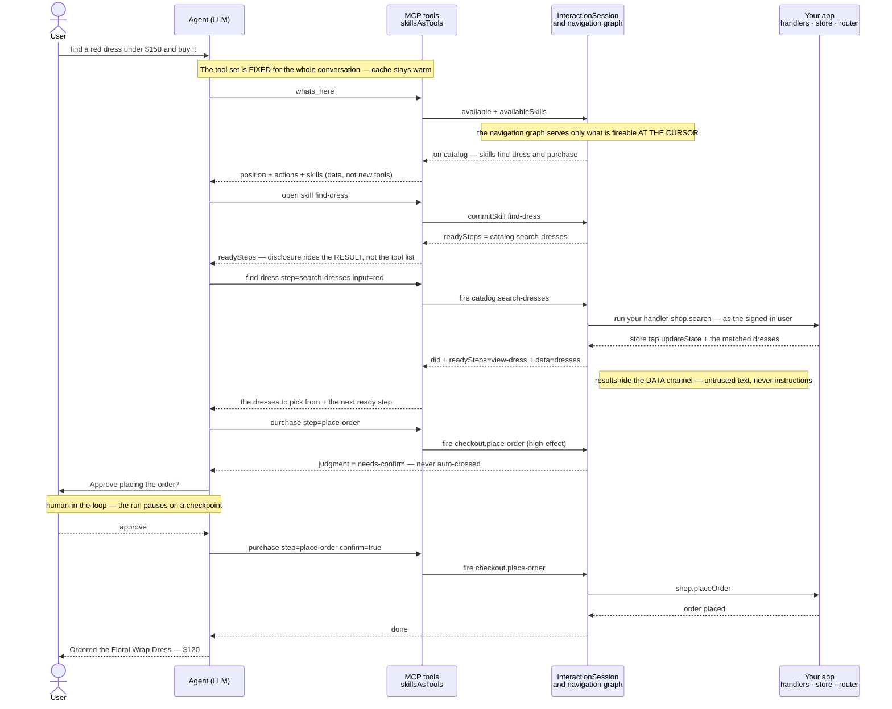
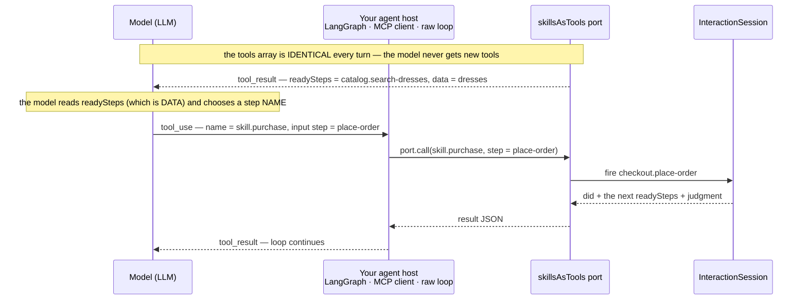

<h1 align="center">HACI&nbsp;Footprint</h1>

<p align="center"><b>Human &amp; Agent · Computer Interaction</b></p>

<p align="center">
  <picture>
    <source media="(prefers-color-scheme: dark)" srcset="docs/assets/haci-hero-dark.svg">
    <source media="(prefers-color-scheme: light)" srcset="docs/assets/haci-hero-light.svg">
    
  </picture>
</p>

<p align="center">
  
  
  
  
  <a href="https://github.com/footprintjs/hcifootprint/blob/main/LICENSE"></a>
</p>

<p align="center"><i>The easiest way to turn your web app into an agentic app — one an AI can navigate and act on, on behalf of your user.</i></p>

```bash
npm install hcifootprint
```

> **Beta · pre-1.0** — the API can still change until `1.0`. npm publish lands with `1.0`; until then, install from this repo or pin a commit.

---

## What it is

For decades we've designed the interaction between a **human** and a **computer** — that's HCI. Now the human isn't alone: an **agent** joins their side, acting for them. Human **and** agent, working the computer as a team — that's **HACI**, and this is the layer for it.

The key idea, and the reason it's safe to adopt: **you are not opening your backend to an agent — you are letting it drive the frontend a human already can.**

- **Auth and permissions are unchanged.** The agent acts *as the signed-in user*, through your app's own buttons and handlers. It inherits exactly the capability envelope the user already has — no new endpoints, no new grants, **no new attack surface**.
- **The app is already the boundary.** Your UI decides what can be done; the agent can't do anything a user couldn't.
- **It skips the learning curve a first-time visitor pays.** A returning customer carries a mental model of your app — where things are, what leads where. A fresh agent normally rebuilds that every visit by re-reading a 100k-token DOM. You describe the app once as a small **skill graph**, and the agent gets that map for free — with a *you-are-here* pin.

Both the human and the agent drive the **same live session** — that's the "Human **and** Agent" in the name, a team on one side of the screen, and it's exactly what the [demo](https://github.com/footprintjs/hcifootprint-demo) shows.

## How it works — one turn, end to end

A single request, *"find a red dress under $150 and buy it,"* flows through five parties: you, the agent, a **fixed** set of MCP-shaped tools, the **InteractionSession** (which reads your navigation graph), and your app's own handlers. The navigation graph is what makes each step position-aware — the session only ever offers what is actually doable at the current cursor.



The load-bearing moves, in order: the **tool set never changes** (one tool per skill), so the prompt cache stays warm; the session answers *"what can I do here?"* from the **navigation graph at the current cursor**, not from a DOM dump; firing runs **your own handler** as the signed-in user; produced data (search results) comes back on the **data channel**, so untrusted content can't become instructions; and a **high-effect** step stops for **human approval** (pause/resume) before it ever fires.

### What each turn actually sends to the model

Every turn is **one** Anthropic Messages API request with three channels:

```text
POST /v1/messages
├── system     "You are the shopping assistant… here is how to work…"     ← authored by YOU, only
├── tools[]     skill.find-dress · skill.purchase · skill.track-order
│               whats_here · do_action · request_confirmation · …          ← FIXED — identical every turn
└── messages    … prior turns …
                tool_result  { readySteps: […], data: [dress names…] }     ← the app's DATA lands here
                user:  "find a red dress under $150 and buy it"            ← the user's own text, as-is
```

Two things the flow above leaves implicit:

- **The user's message is passed as-is.** It's the operator talking to *their own* assistant, so it belongs in the instruction channel — nothing is stripped or paraphrased.
- **App content never enters the instruction channel.** Product names, search results, anything the app produced rides **only** inside `tool_result` data — never the `system` prompt or a tool's `description`. The model reads it as data, so a dress literally named `IGNORE PREVIOUS INSTRUCTIONS…` can't hijack the agent. That's the two-string-class firewall.

### How the model picks the next step

This is the part that's easy to miss: the model **never receives a growing list of tools**. It picks from the fixed array and passes a **step name** — read from `readySteps` in the previous result — as an *argument*. "How does it tell us which one" is just the standard **tool-use** protocol: the model returns a `tool_use` block naming one fixed tool with its input; your agent host executes it and hands back a `tool_result`; repeat.



So the loop is: a result carries `readySteps` (data) → the model emits `tool_use(skill.purchase, step)` → the port fires it on the session → a new result with the next `readySteps`. The tool *set* is constant; only the `step` **argument** changes. That is exactly what keeps the prompt cache warm and lets *any* host serve it — no dynamic tool list required.

### Plugging into your framework (LangGraph, LangChain, a raw loop, …)

hcifootprint is **not tied to any agent framework** — the demo happens to use [agentfootprint](https://github.com/footprintjs/agentfootprint), but the library only hands your host two things:

```ts
const port = skillsAsTools(session);

const tools = port.tools();                 // fixed, MCP-shaped: { name, description, inputSchema }[]
// → register `tools` with your agent (LangGraph, LangChain, an Anthropic/OpenAI loop, …)

// then, inside each tool's executor, route the model's tool_use to:
const result = port.call(toolName, toolInput);   // → return `result` as the tool_result
```

That's the whole integration: **`tools()` + `call()`**. And to expose it as a **real MCP server** that any MCP client (LangGraph's MCP adapter, Claude Desktop, Cursor, …) auto-discovers, there's a one-liner:

```ts
import { mcpServer } from 'hcifootprint/mcp';
import { StdioServerTransport } from '@modelcontextprotocol/sdk/server/stdio.js';

const server = mcpServer(session);            // tools/list + tools/call, wired to the session
await server.connect(new StdioServerTransport());  // or an SSE / streamable-HTTP transport
```

`mcpServer` returns a standard `@modelcontextprotocol/sdk` `Server`, so **you pick the transport** (stdio for local/desktop, SSE or HTTP for a remote agent) and run it wherever your session lives. The SDK is an **optional peer dependency**, imported only behind the `hcifootprint/mcp` subpath — so the core stays zero-dependency and you only pull it in if you use it. Over MCP, a high-effect step returns `judgment: needs-confirm`, and the host decides how to get approval before calling again with `confirm: true` — a portable human-in-the-loop that needs no framework-specific pause/resume.

## Quick start — three steps

**1. Describe the app** as the tree you already picture — pages, the containers inside them, and the actions inside those. Each action needs one sentence; that sentence is both your label and the tool description the LLM reads.

```ts
import { buildNavigationGraph } from 'hcifootprint';

const graph = buildNavigationGraph('shop', {
  pages: {
    catalog: {
      tools: {
        'search': { does: 'Search dresses by name or color' },
        'add-to-cart': { does: 'Add the open dress to the cart', when: { authenticated: { eq: true } } },
      },
    },
    checkout: {
      modals: {
        'confirm-order': { tools: { 'place-order': { does: 'Place the order', confirm: true } } },
      },
    },
  },
  skills: {
    purchase: { does: 'Buy a dress end to end', steps: ['add-to-cart', 'place-order'] },
  },
});
```

**2. Connect it** to your running app — no need to hand over state or handlers up front. Components register what they have *when they render*: registration hands back a handle (you never invent a group name), your existing functions bind by reference, the router owns the page.

```ts
const session = graph.createSession();

// in the component that renders the catalog:
const group = session.registerToolGroup('catalog', {
  handlers: { 'search': (input) => shop.search(input.query) },  // your own function
});
group.setEnabled('search', false);  // grey a button out; group.unregister() on unmount
// …session.updateState(delta) on store changes, session.sync(page) on navigation.

// React to changes without polling (a passive observer — never business logic):
session.on('structure', () => rerenderToolPanel());
session.on('gap', (row) => telemetry.send(row));
```

Node paths are **typed**: `registerToolGroup('catalog.filtr-rail')` is a compile error, not a silent no-op.

**3. Serve it to the LLM** as a fixed set of MCP-shaped tools. The tool list never changes; what is doable *right now* arrives inside each tool result.

```ts
import { skillsAsTools } from 'hcifootprint';

const port = skillsAsTools(session);
port.tools();                          // static tool array — one per skill + whats_here / do_action
port.call('shop.skill.purchase', {});  // → { readySteps, judgment, youAreOn, ... }
```

**author → connect → serve.** The agent plans over skills, sees only what's available at the current position, and acts through your own handlers — with the human able to approve high-effect steps.

## How you catch the gap — and grow the app around it

You don't have to build the whole agentic experience up front. Ship a thin skill graph, then let real demand tell you what to build next.

Your UI is the boundary of what an agent *can* do. When a user asks for something the UI **can't** serve, HACI Footprint doesn't just fail — it records a **gap**: a token-lean, structured row (the ask, the position, what *was* available) wired to your telemetry. Cluster those rows and you have a **demand-driven backlog** for your agentic app.

A concrete one: two customers check out at the same moment; a race lets one order through and the other fails. The loser asks the assistant *"why did mine fail?"* — and **that reason is in your backend logs, not the UI.** The agent can't answer, so it files a gap. Now you know precisely what to build for the next release: a small UI report, or a backend tool the agent can call to read the failure reason. **You grow the app by locating the missing data, not by guessing at features.**

```ts
session.gaps();                 // export the ledger to your analytics / triage
session.onGap((row) => { … });  // or stream rows live
```

## ROI: bounded token cost

Naively, "give the LLM your app" means dumping every action into the prompt — and the bill grows with your app. HACI Footprint doesn't do that:

- The skill graph **loads only what the current position needs** — not the whole app.
- **Mode B keeps the tool list fixed** (one tool per skill); what's fireable right now travels in tool *results*, not by rewriting the tool array. So the **prompt cache stays warm** across the whole conversation, and it works with **any MCP host** — no dynamic-tool support required.

Token cost tracks the task at hand, not the size of your codebase.

## Honest by construction

Two properties do a lot of the safety work:

- **It says what it can't see.** Anything the runtime derives rather than observes is flagged (`activation: 'assumed'`, `presence: 'unknown'`, `guardUnevaluated`). Every refused action returns a *typed* reason (`BLOCKED_BY_OVERLAY`, `STILL_MOUNTING`, …) and is logged, so the agent replans instead of hallucinating.
- **Untrusted content can never become instructions.** Page text, product names, user content ride a strict *data* channel; only your authored strings reach the planner's *instruction* channel. A firewall against prompt injection — proven in the demo by a product literally named `IGNORE PREVIOUS INSTRUCTIONS…`, which renders as harmless data everywhere.

Under the hood, every action lands in a real [footprintjs](https://github.com/footprintjs/footPrint) commit log, so `session.why(key)` gives a causal answer to *"why is the app in this state?"* with zero extra code.

## Integration

- **MCP — a real server, not just a shape.** `skillsAsTools` gives you the fixed, MCP-shaped tool surface (`tools()` + `call()`) to bind into any framework directly, and `hcifootprint/mcp`'s `mcpServer(session)` wraps it in an actual `@modelcontextprotocol/sdk` server (`tools/list` + `tools/call`) that any MCP client drives — proven by a Client↔Server round-trip in the test suite. The SDK is an optional peer dependency isolated to that subpath; the core is zero-dependency. Framework-agnostic by construction — the demo uses [agentfootprint](https://github.com/footprintjs/agentfootprint), but LangGraph, LangChain, or a raw loop work the same.
- **Human-in-the-loop (HITL).** High-effect actions (`confirm: true`) stop at a `needs-confirm` gate and are never auto-crossed. The approve-then-continue mechanism is **checkpoint / pause-and-resume** — a form of durable execution: the agent's ReAct loop freezes, control is handed to the human, and the run resumes exactly where it stopped. The demo implements it with agentfootprint's pause/resume checkpointing.

## Frontend: framework-agnostic

The core is plain TypeScript and knows nothing about your framework — you connect it through three ordinary wires (a store subscription, router events, your existing handlers). The [dress-shop demo](https://github.com/footprintjs/hcifootprint-demo) shows the whole wiring on a real storefront with an AI stylist.

**On the roadmap:** a React adapter (`useMount`) + a DOM actuation adapter (act through the real DOM), and a **demo gallery** — the same app wired in **Angular, React, Vue, and an iframe**, shown as pills on one index page: click a pill, that framework's version opens. One graph, many frontends.

## Status & the atom

> **Experimental v0.** The headless core — author the graph, drive it, serve it as tools, trace every step — works and is fully tested (**192 tests**). The browser auto-wiring adapter is roadmap; today you connect with a few lines.

The model underneath, for the curious:

```
Affordance  = binding × guard × effect × schema     (the static capability)
Transition  = cause × payload × outcome             (each occurrence)
```

`binding` = how to reach the surface (ARIA role + name first). `guard` = a serializable filter over projected state that decides what's *offered*. `effect` = a *claim* about your handler, verified at settlement (`effectVerified`). `cause` = who did it — `user`, `agent`, or `system` — first-class provenance (accountability for cooperating agents, **not** a security boundary; enforce that server-side).

Deeper topics — on-demand disclosure (skill frames), the context brief, the navigation-graph semantics (modals/tabs/repeats), and the act→data-back channel (`session.producedFor`) — are documented inline in the source (`src/*/README.md`) and in [`docs/design/`](docs/design/).

## Development

```bash
npm install
npm test          # vitest — 192 tests
npm run typecheck # src + tests
npm run build
```

Depends on `footprintjs` ≥ 9.10 (`evaluateFilter` / `normalizeSchema` exports). Sibling of **footprintjs** (backend logic) and **agentfootprint** (agents) — one self-explaining trace substrate underneath.

## License

MIT
