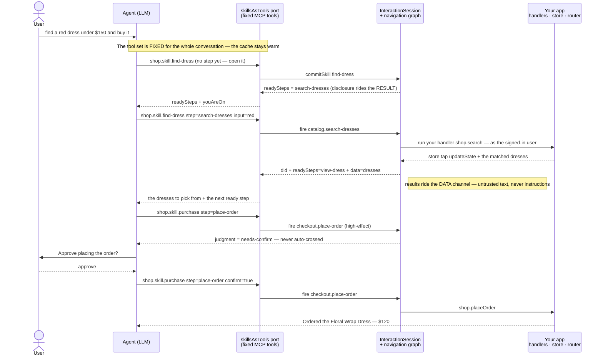

<h1 align="center">HACI&nbsp;Footprint</h1>

<p align="center"><b>Human &amp; Agent · Computer Interaction</b></p>

<p align="center">
  <strong>Your agent can reach your app — but it's flying blind.<br/>
  Your app already knows what can be done here, and by whom. Hand the agent that map.</strong>
</p>

<p align="center">
  Turn a web app's interaction surface into a typed, traversable <strong>skill graph</strong> an LLM agent
  can plan over and act on — on behalf of the signed-in user, through the app's own buttons and handlers.
</p>

<p align="center">
  <picture>
    <source media="(prefers-color-scheme: dark)" srcset="docs/assets/haci-hero-dark.svg">
    <source media="(prefers-color-scheme: light)" srcset="docs/assets/haci-hero-light.svg">
    
  </picture>
</p>

<p align="center">
  
  
  
  
  
  <a href="https://github.com/footprintjs/hcifootprint/blob/main/LICENSE"></a>
</p>

<p align="center">
  <strong>🌐 <a href="https://footprintjs.github.io/hcifootprint/">footprintjs.github.io/hcifootprint</a></strong> — the story in three lenses: <a href="https://footprintjs.github.io/hcifootprint/">Read</a> · <a href="https://footprintjs.github.io/hcifootprint/?view=scrolly">Scroll</a> · <a href="https://footprintjs.github.io/hcifootprint/?view=slides">Watch</a>
</p>

```bash
npm install hcifootprint
```

> **Beta · pre-1.0** — the API can still change until `1.0`. The npm publish lands with `1.0`; until then, install from this repo or pin a commit.

---

## Agents driving UIs are flying blind

An agent can already reach your app. The problem is *how* it operates one:

| How agents drive a UI today | The cost |
|---|---|
| Screenshot the page, reason over pixels | slow and fragile — redone every single turn |
| Dump the DOM into the prompt | ~100k tokens, and it still guesses at what does what |
| Hard-coded selectors / RPA scripts | break on the next redesign |

All three relearn your app from scratch on every visit. But a returning human already carries a mental
model — where things are, what leads where, what they're allowed to do. Your app holds that same map.
**HACI Footprint hands it to the agent** as a typed skill graph the agent *traverses*, instead of a DOM it
re-reads — with a *you-are-here* pin so it only ever sees what is actually doable right now.

## What it is

For decades we've designed the interaction between a **human** and a **computer** — that's HCI. Now the
human isn't alone: an **agent** joins their side, acting for them. Human **and** agent, working the computer
as a team — that's **HACI**, and this is the layer for it.

The key idea, and the reason it's safe to adopt: **you are not opening your backend to an agent — you are
letting it drive the frontend a human already can.**

- **Auth and permissions are unchanged.** The agent acts *as the signed-in user*, through your app's own buttons and handlers. It inherits exactly the capability envelope the user already has. No new endpoints, no new grants, **no new attack surface.**
- **The app is already the boundary.** Your UI decides what can be done. The agent can't do anything a user couldn't.
- **Both drive the same live session.** The human's clicks and the agent's actions flow through one session — a team on one side of the screen. That's the "Human **and** Agent" in the name.

## Quick start — author → connect → serve

Three steps, and the first two run offline with no API key.

**1. Describe the app** as the tree you already picture — pages, the containers inside them, and the actions
inside those. Each action needs one sentence; that sentence is both your label and the tool description the
LLM reads.

```ts
import { buildNavigationGraph } from 'hcifootprint';

const graph = buildNavigationGraph('shop', {
  pages: {
    catalog: {
      tools: {
        'search': { does: 'Search dresses by name or color' },
        'add-to-cart': { does: 'Add the open dress to the cart', when: { authenticated: { eq: true } } },
      },
    },
    checkout: {
      modals: {
        'confirm-order': { tools: { 'place-order': { does: 'Place the order', confirm: true } } },
      },
    },
  },
  skills: {
    purchase: { does: 'Buy a dress end to end', steps: ['add-to-cart', 'place-order'] },
  },
});
```

**2. Connect it** to your running app through three ordinary wires. Components register what they have *when
they render*: registration hands back a handle (you never invent a group name), your existing functions bind
by reference, the router owns the page.

```ts
const session = graph.createSession();

// when the component that renders the catalog mounts:
const group = session.registerToolGroup('catalog', {
  handlers: { 'search': (input) => shop.search(input.query) },   // your own function, by reference
});
group.setEnabled('search', false);   // grey a button out; group.unregister() on unmount

// your existing wires report reality:
session.updateState({ authenticated: true });   // store tap → guards re-evaluate
session.sync('checkout');                        // router change → the cursor moves

// passive observers — never business logic:
session.on('structure', () => rerenderToolPanel());
session.on('gap', (row) => telemetry.send(row));
```

Node paths are **typed**: `registerToolGroup('catalog.filtr-rail')` is a compile error, not a silent no-op.

**3. Serve it to the LLM** as a fixed set of MCP-shaped tools. The tool list never changes; what's doable
*right now* arrives inside each tool result.

```ts
import { skillsAsTools } from 'hcifootprint';

const port = skillsAsTools(session);
port.tools();                          // static tool array — one per skill + whats_here / do_action / why
port.call('shop.skill.purchase', {});  // → { readySteps, judgment, youAreOn, ... }
```

The agent plans over skills, sees only what's available at the current position, and acts through your own
handlers — with the human able to approve high-effect steps.

---

## Pick your door

| 🔌 Serving an agent? | 🕳️ Deciding what to build? | ✅ Shipping to production? |
|---|---|---|
| A fixed, cache-warm tool surface any MCP host can drive — Claude Desktop, LangGraph, a raw loop. | Every ask your app *can't* serve becomes a token-lean gap row — a demand-driven backlog. | A drift harness that fails CI when the graph and the app stop agreeing. |
| [→ Serve to any agent ↓](#-serve-it-to-any-agent--the-mcp-surface) | [→ The gap loop ↓](#-the-gap-loop--grow-the-app-around-real-demand) | [→ Keep the graph true ↓](#-keep-the-graph-true--the-drift-harness) |

---

## 🔌 Serve it to any agent — the MCP surface

The tool array the LLM sees holds **one tool per skill** plus three fixed generics (`whats_here`, `do_action`, `why`),
and it **never changes for the life of a conversation**. Disclosure rides the *result* channel: every call
returns `readySteps` — what's fireable at the current cursor — and the model acts by calling the same skill
tool again with a `step`. Tools render first in the prompt, so a stable tool set keeps the **prompt cache
warm**, and any plain MCP host can drive it with no dynamic-tool support required.

### One turn, end to end

A single request, *"find a red dress under $150 and buy it,"* flows through five parties. The navigation
graph is what makes each step position-aware — the session only ever offers what is fireable at the current
cursor.



The load-bearing moves, in order: the **tool set never changes**, so the prompt cache stays warm; the session
answers *"what can I do here?"* from the **graph at the current cursor**, not a DOM dump; firing runs **your
own handler** as the signed-in user; produced data comes back on the **data channel** (so untrusted content
can't become instructions); and a **high-effect** step stops for **human approval** before it ever fires.

### What each turn actually sends to the model

Every turn is **one** Messages API request with three channels:

```text
POST /v1/messages
├── system     "You are the shopping assistant… here is how to work…"     ← authored by YOU, only
├── tools[]     shop.skill.find-dress · shop.skill.purchase · …
│               shop.whats_here · shop.do_action · shop.why               ← FIXED — identical every turn
└── messages    … prior turns …
                tool_result  { readySteps: […], data: [dress names…] }    ← the app's DATA lands here
                user:  "find a red dress under $150 and buy it"           ← the user's own text, as-is
```

Two things worth making explicit:

- **The user's message is passed as-is.** It's the operator talking to *their own* assistant, so it belongs in the instruction channel — nothing is stripped or paraphrased.
- **App content never enters the instruction channel.** Product names and search results ride **only** inside `tool_result` data — never the `system` prompt, never a tool's `description`. So a dress literally named `IGNORE PREVIOUS INSTRUCTIONS…` reads as harmless data. That's the two-string-class firewall.

The model never receives a growing list of tools. It picks from the fixed array and passes a **step name** —
read from `readySteps` in the previous result — as an *argument*. The tool *set* is constant; only the `step`
changes. That's exactly what keeps the cache warm and lets any host serve it.

### Plug into any framework — or run a real MCP server

hcifootprint is **not tied to any agent framework**. The library hands your host two functions:

```ts
const port = skillsAsTools(session);

const tools = port.tools();                 // fixed, MCP-shaped: { name, description, inputSchema }[]
// → register `tools` with your agent (LangGraph, LangChain, an Anthropic/OpenAI loop, …)

// then, inside each tool's executor, route the model's tool_use to:
const result = port.call(toolName, toolInput);   // → return `result` as the tool_result
```

That's the whole integration — **`tools()` + `call()`**. To expose it as a **real MCP server** any client
auto-discovers, there's a one-liner:

```ts
import { mcpServer } from 'hcifootprint/mcp';
import { StdioServerTransport } from '@modelcontextprotocol/sdk/server/stdio.js';

const server = mcpServer(session);                 // tools/list + tools/call, wired to the session
await server.connect(new StdioServerTransport());  // or an SSE / streamable-HTTP transport
```

`mcpServer` returns a standard `@modelcontextprotocol/sdk` `Server`, so **you pick the transport** and run it
wherever your session lives. Over MCP, a high-effect step returns `judgment: 'needs-confirm'` and the host
decides how to get approval before calling again with `confirm: true` — a portable human-in-the-loop that
needs no framework-specific pause/resume. The SDK is an **optional peer dependency**, imported only behind the
`hcifootprint/mcp` subpath, so the core stays zero-dependency and you pull it in only if you use it.

> This cooperates with Anthropic's MCP rather than competing with it: the skill graph *is* the server, and
> any MCP host drives the same live session.

---

## 🕳️ The gap loop — grow the app around real demand

You don't have to build the whole agentic experience up front. Ship a thin skill graph, then let real demand
tell you what to build next.

Your UI is the boundary of what an agent *can* do. When a user asks for something the UI **can't** serve,
HACI Footprint doesn't just fail — it records a **gap**: a token-lean, structured row (the ask, the position,
what *was* available) wired to your telemetry. The agent calls the gap tool **before** it apologizes, so
every miss becomes a ledger row your team reads. Cluster those rows and you have a **demand-driven backlog**
for your agentic app.

A concrete one: two customers check out at the same moment, and a race lets one order through while the other
fails. The loser asks the assistant *"why did mine fail?"* — but **that reason is in your backend logs, not
the UI.** The agent can't answer, so it files a gap with reason `needs-backend-data`. Now you know precisely
what to build for the next release — a small UI report, or a backend tool the agent can call. **You grow the
app by locating the missing data, not by guessing at features.**

```ts
session.gaps();                 // export the whole ledger to your analytics / triage
session.onGap((row) => { … });  // or stream rows live (sugar for session.on('gap', …))
```

Rows are deliberately structured and name-only — the ask plus lists of available action/skill names, never
descriptions or transcripts — so a batch triage LLM can cluster thousands of them cheaply.

---

## 🛟 Human-in-the-loop

High-effect actions (`confirm: true` in the graph) stop at a `needs-confirm` gate and are **never
auto-crossed**. The agent must ask the human, then call again with `confirm: true`. Two ways to run the
approval:

- **Over MCP** — the gate is just data in the result (`judgment: 'needs-confirm'`), and the host decides how to collect the yes. Portable, framework-free.
- **In-process** — pause the agent's ReAct loop on a checkpoint, hand control to the human, and resume exactly where it stopped. The demo implements this with agentfootprint's pause/resume checkpointing.

Either way, the gate is enforced at the session, so an agent can't fire a high-effect action without a real
approval.

## 🔒 Honest by construction

Two properties do most of the safety work:

- **It says what it can't see.** Anything the runtime *derives* rather than *observes* is flagged — `activation: 'assumed'`, `presence: 'unknown'`, `guardUnevaluated`. Every refused action returns a *typed* reason (`BLOCKED_BY_OVERLAY`, `STILL_MOUNTING`, `GUARD_FAILED`, …) and is logged, so the agent replans instead of hallucinating.
- **Untrusted content can never become instructions.** Page text, product names, and user content ride a strict *data* channel; only your authored strings reach the planner's *instruction* channel. It's a firewall against prompt injection — proven in the demo by a product literally named `IGNORE PREVIOUS INSTRUCTIONS…`, which renders as harmless data everywhere.

Under the hood, every action lands in a real [footprintjs](https://github.com/footprintjs/footPrint) commit
log, so `session.why(key)` gives a causal answer to *"why is the app in this state?"* with zero extra code.

---

## ✅ Keep the graph true — the drift harness

The navigation graph is a **second artifact** you keep alongside the real app, so it **drifts** as the app
changes: a button's disable rule moves, a page is removed, a handler starts writing different state.
`hcifootprint/testing` catches that drift **in dev and CI, before production**. It adds **zero dependencies**,
is tree-shakeable, and drives the **real session** (never a copy), in two layers.

**1. `lintGraph` / `checkGraph` — static, no test code.** Read the graph alone and report stale logic: a
control gated on state nothing produces, a guard that can never be true, a skill that can never finish, a page
nothing can reach. This is the cheap CI gate. It's **advisory by default** and only escalates to hard errors
once you tell it the starting state — it never cries "dead" over a key it can't see.

```ts
import { lintGraph, checkGraph, expectNoStaleLogic } from 'hcifootprint/testing';

lintGraph(graph);                                  // → findings you can inspect
expectNoStaleLogic(graph, { initialState });       // → throws in CI if the graph drifted

// Or the one-call health verdict — findings grouped by drift type + a printable report:
const health = checkGraph(graph, { initialState });
if (!health.ok) { console.error(health.summary); process.exit(1); }
```

`checkGraph` is static and pure — import it from `hcifootprint/testing/lint` for a CI step that loads no
engine code at all. Every finding names **what** drifted and **where**, and states the two remedies (update
the graph, or fix the app that changed by mistake). It surfaces the drift; **the fix is your team's call.**

**2. `testApp` — "Playwright for your interaction logic, minus the browser."** Write mock handlers (one per
action, returning a state change), then drive the graph as a **user** (clicking) or as the **agent** (the
real Mode B tool path). The library's own honesty marker, `effectVerified`, flips false when a handler no
longer does what the graph declares — that *is* the behavioral-drift alarm. **Report by default; pass
`strict: true` to fail the instant drift appears.**

```ts
import { testApp } from 'hcifootprint/testing';

const app = testApp(graph, {
  initialState: { cartCount: 0 },
  resolvers: { 'add-to-cart': (_p, { state }) => ({ patch: { cartCount: state.cartCount + 1 } }) },
});

await app.user.fire('add-to-cart');                         // drive like a human
app.expectState({ cartCount: 1 });
await app.agent.skill('purchase', { step: 'go-to-cart' });  // drive like the LLM
app.expectOn('cart');
app.report();                                               // { ok, effectDrift, unevaluatedGuards, gaps }
```

**Honest boundary (say it out loud).** This tests interaction **logic** above the binding — guards, skills,
navigation, effect claims, typed rejections. It does **not** verify pixels, the DOM, or that a binding
resolves to a real element — that stays **Playwright's** job, and this complements it rather than replacing
it. A green `lintGraph` proves the graph is internally consistent, **not** that the app works: it reasons
about which state *keys* move, never their values, so a right-key/wrong-value bug is the harness's job
(`effectVerified`), not the linter's. And a mock is a *simulation* — if it diverges from the real handler, the
test is green while prod is broken. For full fidelity, pass `testApp({ session })` with your own wired
session.

---

## 💰 Bounded token cost

Naively, "give the LLM your app" means dumping every action into the prompt — and the bill grows with your
codebase. HACI Footprint doesn't do that:

- The skill graph **loads only what the current position needs**, not the whole app.
- The tool list stays **fixed** (one tool per skill); what's fireable right now travels in tool *results*, not by rewriting the tool array. So the **prompt cache stays warm** across the whole conversation.

Token cost tracks the task at hand, not the size of your codebase.

## Frontend: framework-agnostic

The core is plain TypeScript and knows nothing about your framework — you connect it through three ordinary
wires (a store subscription, router events, your existing handlers). The
[dress-shop demo](https://github.com/footprintjs/hcifootprint-demo) shows the whole wiring on a real
storefront with an AI stylist.

**On the roadmap:** a React adapter (`useMount`) and a DOM actuation adapter (act through the real DOM), plus
a demo gallery — the same app wired in Angular, React, Vue, and an iframe, shown as pills on one index page.
One graph, many frontends.

## The model — Affordance &amp; Transition

For the curious, the whole thing rests on two atoms:

```
Affordance  = binding × guard × effect × schema     (the static capability)
Transition  = cause × payload × outcome             (each occurrence)
```

- **`binding`** — how to reach the surface (ARIA role + name first).
- **`guard`** — a serializable filter over projected state that decides what's *offered*.
- **`effect`** — a *claim* about your handler, verified at settlement (`effectVerified`).
- **`cause`** — who did it: `user`, `agent`, or `system`. First-class provenance for accountability between cooperating agents — **not** a security boundary; enforce that server-side.

Deeper topics — on-demand disclosure (skill frames), the context brief, the navigation-graph semantics
(modals / tabs / repeats), and the act→data-back channel (`session.producedFor`) — are documented inline in
the source (`src/*/README.md`) and in [`docs/design/`](docs/design/).

---

## Live demo — the dress shop, in three commits

The [dress-shop demo](https://github.com/footprintjs/hcifootprint-demo) tells the pitch as a diff, because
the diff *is* the demo:

<p align="center">
  <a href="https://youtu.be/vx5amF94ipI">
    
  </a>
  <br>
  <em>▶ Watch the demo — a vanilla dress shop becomes an agent-operable app (37 sec)</em>
</p>

| Commit | What it adds | What it proves |
|---|---|---|
| 1 | The plain store — subscribers, a tiny router, handler methods. | The unbiased baseline, built with zero knowledge of any agent layer. |
| 2 | The agent layer (this library): the declared graph + three wires. | `git diff` of the app's own code → **empty**. Position-aware tools, guards mirroring the app's invariants, hostile catalog text confined to the data channel. |
| 3 | The assistant (agentfootprint + Claude) driving the same session. | The whole family in one loop, with **human-in-the-loop by checkpoint** on order placement. |

```bash
git clone https://github.com/footprintjs/hcifootprint-demo && cd hcifootprint-demo/dress-shop
npm install
npm test          # commits 1+2: the app's tests + the integration proof (no API key)

cp .env.template .env   # add your ANTHROPIC_API_KEY
npm run chat      # commit 3: the assistant in your terminal
npm run serve     # the storefront in a browser — click OR chat, same session
npm run drift     # watch the drift harness catch a deliberately-drifted graph
```

`npm run serve` also ships an **agent debugger** at `/debug` — powered by
[AgentThinkingUI](https://github.com/footprintjs/agentThinkingUI), it drives the *same* live session as the
storefront, so you chat and watch the agent reason beat-by-beat (`whats_here` → open a skill → fire steps →
the answer).

## Development

```bash
npm install
npm test          # vitest — 267 tests
npm run typecheck # src + tests
npm run build
```

Depends on `footprintjs` ≥ 9.10 (`evaluateFilter` / `normalizeSchema` exports). Sibling of **footprintjs**
(backend logic) and **agentfootprint** (agents) — one self-explaining trace substrate underneath.

## Built on

[footprintjs](https://github.com/footprintjs/footPrint) — the flowchart pattern for backend code. Every
action a session fires lands in a footprintjs commit log, which is what makes `session.why(key)` a real
backward causal slice rather than a guess. You don't need to learn footprintjs to use this library, but if you
want to build primitives at that depth, [start there](https://footprintjs.github.io/footPrint/).

## License

MIT © [Sanjay Krishna Anbalagan](https://github.com/sanjay1909)
